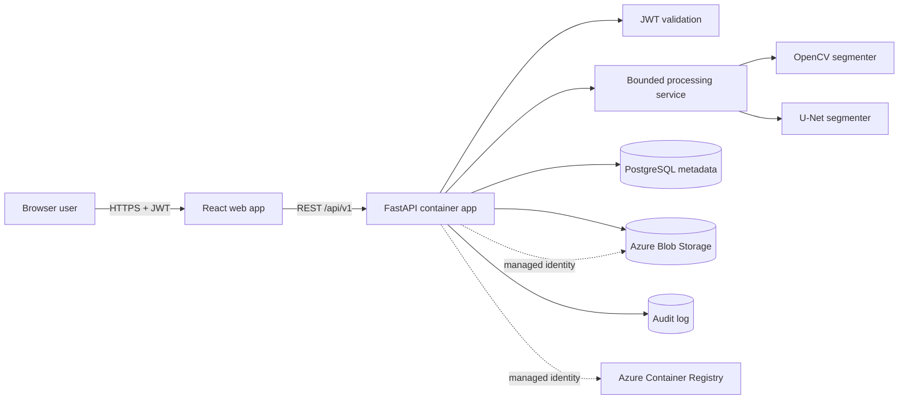

# Iris Isolation Platform Architecture

## Goals

Iris Isolation Platform accepts one or more eye photographs, validates and stores each upload, segments the iris with either OpenCV or a U-Net model, and returns a transparent PNG plus a confidence score. The design keeps image processing independent from HTTP, storage, and database concerns so segmentation implementations can be tested and replaced safely.

## System Context



## Runtime Boundaries

- **Frontend:** React, TypeScript, Vite, and Tailwind CSS. It owns interaction state, local previews, upload progress, before/after comparison, theme preference, and download behavior.
- **API:** FastAPI owns authentication, request validation, rate limiting, orchestration, audit events, and stable REST contracts.
- **Application services:** Framework-independent use cases coordinate repositories, object storage, and segmentation ports.
- **Computer vision:** `OpenCVIrisSegmenter` provides the default classical pipeline. `UNetIrisSegmenter` loads an optional PyTorch checkpoint behind the same interface.
- **Persistence:** SQLAlchemy repositories store metadata in PostgreSQL. A local SQLite-compatible path is available for development and tests.
- **Object storage:** Azure Blob Storage is used in Azure. A filesystem adapter is used locally and in unit tests.

## Processing Flow

1. The API validates authentication, MIME type, decoded image type, dimensions, and maximum byte size.
2. The original image is stored under a generated UUID; user-supplied names never become storage paths.
3. The selected segmenter locates the pupil and outer iris boundary, builds an annular mask, removes eyelid/eyelash noise, and computes confidence.
4. The mask becomes the alpha channel of a lossless PNG.
5. Metadata and processing status are committed to the database, followed by an audit event.
6. The API returns metadata and stable result/download URLs. Batch requests process bounded concurrent jobs and return per-item outcomes.

## Database Schema

```sql
CREATE TABLE images (
    id UUID PRIMARY KEY,
    filename VARCHAR(255) NOT NULL,
    content_type VARCHAR(64) NOT NULL,
    upload_date TIMESTAMPTZ NOT NULL DEFAULT NOW(),
    status VARCHAR(32) NOT NULL,
    segmentation_method VARCHAR(16) NOT NULL,
    confidence_score DOUBLE PRECISION,
    original_path TEXT NOT NULL,
    extracted_path TEXT,
    error_code VARCHAR(64),
    owner_subject VARCHAR(255) NOT NULL,
    sha256 VARCHAR(64) NOT NULL,
    width INTEGER,
    height INTEGER
);

CREATE INDEX ix_images_owner_uploaded
    ON images (owner_subject, upload_date DESC);

CREATE TABLE audit_events (
    id UUID PRIMARY KEY,
    occurred_at TIMESTAMPTZ NOT NULL DEFAULT NOW(),
    actor_subject VARCHAR(255) NOT NULL,
    action VARCHAR(80) NOT NULL,
    image_id UUID REFERENCES images(id) ON DELETE SET NULL,
    outcome VARCHAR(32) NOT NULL,
    correlation_id VARCHAR(64) NOT NULL,
    client_ip_hash VARCHAR(64),
    details JSONB NOT NULL DEFAULT '{}'::jsonb
);
```

Raw images and tokens are never written to audit details. Database records can be expired independently from blobs by a retention worker.

## Security Model

- HTTPS is enforced at Azure Container Apps ingress and production proxy headers are trusted only from configured proxies.
- JWTs are verified by issuer, audience, signature, expiry, and algorithm. Local development tokens use an explicit development-only secret.
- Uploads are decoded with Pillow/OpenCV after MIME and signature checks; decompression bombs, traversal names, oversized files, and unsupported formats are rejected.
- Per-subject and per-IP rate limits protect processing endpoints. Batch size and worker concurrency are bounded.
- Storage disables anonymous access and shared-key authorization. The API uses workload identity and least-privilege RBAC.
- Secrets are referenced from Key Vault. Logs use correlation IDs and structured redaction.
- Security headers, explicit CORS origins, non-root containers, read-only-friendly filesystems, and dependency pinning reduce the application attack surface.

## Azure Topology

- Azure Container Registry for immutable frontend/backend images.
- Azure Container Apps environment connected to Log Analytics.
- Public frontend Container App and public API Container App with restricted CORS; PostgreSQL and Blob access use managed identity where supported.
- Azure Database for PostgreSQL Flexible Server 17 for metadata.
- General-purpose v2 Storage Account with private containers, local auth disabled, and no anonymous access.
- Key Vault with RBAC for secrets required by deployment.
- User-assigned managed identity with explicit `AcrPull`, Blob Data Contributor, and Key Vault secret permissions.

## Monorepo Structure

```text
IrisIsolationPlatform/
|-- frontend/
|   |-- src/
|   |   |-- api/
|   |   |-- components/
|   |   |-- hooks/
|   |   |-- pages/
|   |   `-- types/
|   |-- Dockerfile
|   `-- package.json
|-- backend/
|   |-- app/
|   |   |-- api/
|   |   |-- application/
|   |   |-- core/
|   |   |-- infrastructure/
|   |   |-- models/
|   |   `-- main.py
|   |-- migrations/
|   |-- tests/
|   |-- Dockerfile
|   `-- pyproject.toml
|-- ml/
|   |-- datasets/
|   |-- train.py
|   `-- README.md
|-- infra/
|   |-- main.bicep
|   |-- main.parameters.json
|   `-- deploy.ps1
|-- docs/
|   |-- architecture.md
|   `-- api.md
|-- compose.yaml
|-- .env.example
`-- README.md
```

## Scaling Decisions

- The initial API performs bounded in-process segmentation because a single image typically completes within an HTTP request window.
- The use-case boundary can move to a queue/worker without changing REST response models or segmenters when GPU jobs or high-volume batches require asynchronous processing.
- U-Net is optional at runtime; CPU deployments stay lean, while a dedicated GPU worker image can install the model dependency group.
